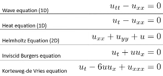
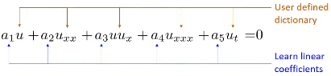

# Using PINN for Inverse Problems

João Pereira - IMPA 
*2024-05-13* 

My personal notes about the seminar.  

<https://www.youtube.com/watch?v=9vwQbrAx8D0>  

- The various PDEs can be seen as a simple linear combination

- The problem is to determine the PDE that best represents the data

- Initially, a set of possible derivative terms is estimated

- Let $p_1, …, p_k$ be sample random points in the domain

- If $u$ is a solution of the PDE

$a_1 u + a_2 u_{xx} + a_3 uu_x + a_4 u_{xxx} + a_5 u_t = 0$

- For all $p_1, …, p_k$

$a_1 u (p_k) + a_2 u_{xx} (p_k) + a_3 u (p_k) u_x(p_k) + a_4 u_{xxx} (p_k) + a_5 u_t (p_k) = 0 $

- In matrix form:

$\left[\begin{array}{c c c c} u(p_1) & u_{x x}(p_1) & u(p_1)u_x(p_1)& u_{x x x}(p_1) & u_t(p_1) \\\ \vdots & \vdots & \vdots & \vdots & \vdots  \\\ u(p_k) & u_{x x}(p_k) & u(p_k)u_x(p_k) & u_{x x x}(p_k) & u_t(p_k) \end{array} \right]
\left[\begin{array}{c} a_1 \\\ \vdots \\\ a_5 \end{array} \right]=0$

- 
