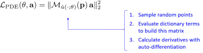

# Using PINN for Inverse Problems

My personal notes about the seminar [Using Physics-informed Neural Networks for Inverse Problems](https://www.youtube.com/live/9vwQbrAx8D0) by [João Pereira - IMPA](http://w3.impa.br/~jpereira/) at [National Scientific Computing Laboratory (LNCC)](https://www.gov.br/lncc/pt-br) on 2024-05-13.

<!-- more -->

Presentation generated from the video: [PINN-Presentation-Pereira.pdf](../../../assets/pdf/PINN-Presentation-Pereira.pdf) (in Portuguese)

The seminar mainly deals with two published articles, and also a third that has not yet been published:

* HASAN, A.; M. PEREIRA, J.; FARSIU, S.; TAROKH, V. Identifying Latent Stochastic Differential Equations. IEEE Transactions on Signal Processing, [N.p.], vol. 70, pp. 89–104, 2022. DOI: 10.1109/TSP.2021.3131723. Available at: https://ieeexplore.ieee.org/document/9632430/.
* HASAN, A.; PEREIRA, J. M.; RAVIER, R.; FARSIU, S.; TAROKH, V. Learning Partial Differential Equations from Data Using Neural Networks. [N.p.], 22 Oct. 2019. Available at: http://arxiv.org/abs/1910.10262.
* BIZZI, A.; NISSENBAUM, L.; PEREIRA, J. M. Neural Conjugate Flows: Physics-informed architectures with flow structure. arXiv, no. arXiv:2411.08326, 13 Nov. 2024. DOI: 10.48550/arXiv.2411.08326. Available at: http://arxiv.org/abs/2411.08326.

- Code:
    - <http://github.com/alluly/pde-estimation>
    - <http://github.com/alluly/ident-latent-sde>

## PINN

- The various PDEs can be seen as a simple linear combination

| Equation          | PDE                            |
| ----------------- | ------------------------------ |
| Wave (1D)         | $u_{tt} - u_{xx} = 0$          |
| Heat (1D)         | $u_{t} - u_{xx} = 0$           |
| Helmholtz (2D)    | $u_{xx} + u_{yy} + u= 0$       |
| Burgers (1D)      | $u_{t} + uu_{x} = 0$           |
| Korteweg-de Vries | $u_{t} - 6uu_{x} + u_{xxx}= 0$ |

- The problem is to determine the PDE that best represents the data

- Initially, a set of possible derivative terms is estimated

- Let $p_1, …, p_k$ be sample random points in the domain

- If $u$ is a solution of the PDE

$a_1 u + a_2 u_{xx} + a_3 uu_x + a_4 u_{xxx} + a_5 u_t = 0$

- For all $p_1, …, p_k$

$a_1 u (p_k) + a_2 u_{xx} (p_k) + a_3 u (p_k) u_x(p_k) + a_4 u_{xxx} (p_k) + a_5 u_t (p_k) = 0 $

- In matrix form:

$\underbrace{
\left[
\begin{array}{c c c c} u(p_1) & u_{x x}(p_1) & u(p_1)u_x(p_1)& u_{x x x}(p_1) & u_t(p_1) \\\ 
\vdots & \vdots & \vdots & \vdots & \vdots \\\ 
u(p_k) & u_{x x}(p_k) & u(p_k)u_x(p_k) & u_{x x x}(p_k) & u_t(p_k)
\end{array} 
\right]
}_{\mathcal{M}_u(p)}
\left[
\begin{array}{c}
a_1 \\\ \vdots \\\ a_5 
\end{array} 
\right]=0$

- The vector $a = (a_1, ..., a_5)$ is in the null space of $\mathcal{M}_u(p)$
- In matrix form: $\mathcal{M}_u(p) a = 0$
- The *null space vector* is a singular vector with singular value 0
  - The **null space vector** (also known as the **null vector**) refers to the zero vector in the context of linear algebra
  - The null space vector is simply the zero vector itself: **0**
  - It is the unique vector that belongs to the null space of any matrix
  - When we say *null space vector*, we are referring to the specific vector **v** that satisfies the condition **Av = 0** for a given matrix **A**
- Let's think about optimization
- Calculate the smallest singular value using the min-max principle

$ \underset{ a }{ \min } \quad \| \mathcal{M}_u(p) a \|_2^2 $

subject to $ \quad \| a \|_2 = 1 \quad $ (Euclidean norm)

$ \| a \|_2 = \sqrt{a_1^2 + \cdots + a_n^2} $

- Bringing together the losses

- Fitting the neural network $\hat{u}(\cdot;\theta)$

- Learning the PDE

- Encourage law sparsity

- Training
  
  

- Minimizing $\mathcal{L}_{PDE} (\theta,a)$ in terms of $\theta$ enforces that the ANN is a solution to the  PDE being learned.

## Stochastic PINN

The Stochastic Physics-Informed Neural Network (S-PINN) framework extends the identification of governing laws to systems characterized by inherent randomness or latent dynamics. This methodology addresses the inverse problem of discovering the drift and diffusion coefficients of Stochastic Differential Equations (SDEs) from observed data snapshots or probability densities.

### Mathematical Framework

A stochastic process $X_t$ is modeled via an Itô SDE (Kiyosi Itô Stochastic Differential Equation) of the form:
$$
dX_t = f(X_t, t)dt + g(X_t, t)dW_t
$$
where $f(X_t, t)$ denotes the **drift** coefficient, $g(X_t, t)$ represents the **diffusion** coefficient, and $W_t$ is a standard Wiener process. The objective in the inverse problem is to identify the functional forms of $f$ and $g$ using a candidate library of differential operators or neural network approximations.

### Fokker-Planck Equation Constraint

Physical consistency is maintained by enforcing the **Fokker-Planck Equation (FPE)**, which governs the time evolution of the probability density function $p(x, t)$:
$$
\frac{\partial p(x, t)}{\partial t} = -\sum_{i=1}^d \frac{\partial}{\partial x_i} [f_i(x, t) p(x, t)] + \frac{1}{2} \sum_{i,j=1}^d \frac{\partial^2}{\partial x_i \partial x_j} [ (g(x, t) g(x, t)^\top)_{ij} p(x, t) ]
$$
The training process involves minimizing a multi-objective loss function $\mathcal{L} = \mathcal{L}_{data} + \lambda_{phys} \mathcal{L}_{FPE} + \lambda_{reg} \mathcal{L}_{reg}$. The physics loss $\mathcal{L}_{FPE}$ penalizes the residue of the Fokker-Planck Equation, ensuring the learned drift and diffusion are consistent with the observed density evolution. Sparsity-promoting regularizations, such as the $L_1$ norm, are applied to identify parsimonious governing equations.

### Neural Conjugate Flows

Recent developments introduce **Neural Conjugate Flows**, which utilize physics-informed architectures with specific flow structures. This approach allows for efficient density estimation and improved uncertainty quantification by enforcing conjugate structures within the neural network, bridging generative modeling with the discovery of physical laws.

## Links of interest

- I WANT SCIENCE. [Artificial Intelligence and Physics: Solving Inverse Problems with Neural Networks](https://www.gov.br/lncc/pt-br/assuntos/noticias/ultimas-noticias-1/quero-quero-ciencia-inteligencia-artificial-e-fisica-solucionando-problemas-inversos-com-redes-neurais) (in Portuguese).
- [Schedule of the event](https://sites.google.com/view/erad-sp2023/programa%C3%A7%C3%A3o) where the lecture was given (in Portuguese).
