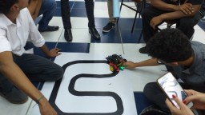

# Classroom activities

## 2019-04-29 competition

(click on image to display larger version)

As a teacher of the classes, I proposed a line-following robot competition, which resulted in the article "Interview with Computer Science students about the construction of robots", [available on the Ibirapuera website](https://web.archive.org/web/20201204174705/https://www.ibirapuera.br/entrevista-com-alunos-de-ciencia-da-computacao-sobre-a-construcao-de-robos/), and details the experience of a group of students who developed a line-following robot for a competition. The article addresses the stages of the project and the role of its members, the process of creation and technical development of the robot (involving the UNIBTRON and PREDADOR teams), in addition to the dissemination of the work through a website and the production of a scientific article.

 Last edited: 2025-07-21 11:30:57
