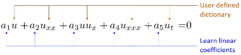
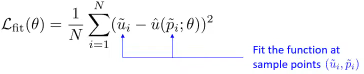
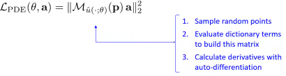
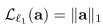

# Using PINN for Inverse Problems

*Last edited: 2024-05-28*

My personal notes about the seminar [Using Physics-informed Neural Networks for Inverse Problems](https://www.youtube.com/live/9vwQbrAx8D0) by [João Pereira - IMPA](http://w3.impa.br/~jpereira/) at [National Scientific Computing Laboratory (LNCC)](https://www.gov.br/lncc/pt-br) on 2024-05-13.

<!-- more -->

Presentation generated from the video: [PINN-Presentation-Pereira.pdf](../pdf/PINN-Presentation-Pereira.pdf) (in Portuguese)

The seminar mainly deals with two published articles, and also a third that has not yet been published:

Hasan, A., Pereira, J. M., Ravier, R., Farsiu, S., & Tarokh, V. (2019). Learning Partial Differential Equations from Data Using Neural Networks. <http://arxiv.org/abs/1910.10262>

Hasan, A., M. Pereira, J., Farsiu, S., & Tarokh, V. (2022). Identifying Latent Stochastic Differential Equations. IEEE Transactions on Signal Processing, 70, 89–104. <https://doi.org/10.1109/TSP.2021.3131723>

Bizzi, A., L. Nissenbaum, Pereira, J. M. (In Preparation) Neural Conjugate Flows: a Physics-Informed Architecture with Differential Flow Structure.

- Code:
    - <http://github.com/alluly/pde-estimation>
    - <http://github.com/alluly/ident-latent-sde>

## PINN

- The various PDEs can be seen as a simple linear combination

| Equation          | PDE                            |
| ----------------- | ------------------------------ |
| Wave (1D)         | $u_{tt} - u_{xx} = 0$          |
| Heat (1D)         | $u_{t} - u_{xx} = 0$           |
| Helmholtz (2D)    | $u_{xx} + u_{yy} + u= 0$       |
| Burgers (1D)      | $u_{t} + uu_{x} = 0$           |
| Korteweg-de Vries | $u_{t} - 6uu_{x} + u_{xxx}= 0$ |

- The problem is to determine the PDE that best represents the data

- Initially, a set of possible derivative terms is estimated

- Let $p_1, …, p_k$ be sample random points in the domain

- If $u$ is a solution of the PDE

$a_1 u + a_2 u_{xx} + a_3 uu_x + a_4 u_{xxx} + a_5 u_t = 0$

- For all $p_1, …, p_k$

$a_1 u (p_k) + a_2 u_{xx} (p_k) + a_3 u (p_k) u_x(p_k) + a_4 u_{xxx} (p_k) + a_5 u_t (p_k) = 0 $

- In matrix form:

$\underbrace{
\left[
\begin{array}{c c c c} u(p_1) & u_{x x}(p_1) & u(p_1)u_x(p_1)& u_{x x x}(p_1) & u_t(p_1) \\\ 
\vdots & \vdots & \vdots & \vdots & \vdots \\\ 
u(p_k) & u_{x x}(p_k) & u(p_k)u_x(p_k) & u_{x x x}(p_k) & u_t(p_k)
\end{array} 
\right]
}_{\mathcal{M}_u(p)}
\left[
\begin{array}{c}
a_1 \\\ \vdots \\\ a_5 
\end{array} 
\right]=0$

- The vector $a = (a_1, ..., a_5)$ is in the null space of $\mathcal{M}_u(p)$
- In matrix form: $\mathcal{M}_u(p) a = 0$
- The *null space vector* is a singular vector with singular value 0
  - The **null space vector** (also known as the **null vector**) refers to the zero vector in the context of linear algebra
  - The null space vector is simply the zero vector itself: **0**
  - It is the unique vector that belongs to the null space of any matrix
  - When we say *null space vector*, we are referring to the specific vector **v** that satisfies the condition **Av = 0** for a given matrix **A**
- Let's think about optimization
- Calculate the smallest singular value using the min-max principle

$ \underset{ a }{ \min } \quad \| \mathcal{M}_u(p) a \|_2^2 $

subject to $ \quad \| a \|_2 = 1 \quad $ (Euclidean norm)

$ \| a \|_2 = \sqrt{a_1^2 + \cdots + a_n^2} $

- Bringing together the losses

- Fitting the neural network $\hat{u}(\cdot;\theta)$

- Learning the PDE

- Encourage law sparsity

- Training
  
  

- Minimizing $\mathcal{L}_{PDE} (\theta,a)$ in terms of $\theta$ enforces that the ANN is a solution to the  PDE being learned.

## Stochastic PINN

- (in construction)

## Links of interest

- I WANT SCIENCE. [Artificial Intelligence and Physics: Solving Inverse Problems with Neural Networks](https://www.gov.br/lncc/pt-br/assuntos/noticias/ultimas-noticias-1/quero-quero-ciencia-inteligencia-artificial-e-fisica-solucionando-problemas-inversos-com-redes-neurais) (in Portuguese).
- [Schedule of the event](https://sites.google.com/view/erad-sp2023/programa%C3%A7%C3%A3o) where the lecture was given (in Portuguese).
