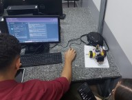

# Classroom activities

2025-04-15

This gallery documents an interdisciplinary, project-based learning initiative where students developed a line-following robot competition. This hands-on activity required collaborative teamwork and the application of a structured methodology to integrate concepts and skills from diverse disciplines within the curriculum. Through the process of design, building, and programming the robots, students gained practical experience and developed problem-world problem-solving skills. The project culminated in a competitive event and showcased the students' work. As part of the project documentation and an introduction to academic publishing, the students also produced a brief introductory article summarizing their approach and outcomes. Some past publications are listed in [pub-courses](pub-courses.md).

Description of the project developed during the semester (in Portuguese): [teach-project](teach-project.md).

(click on the images to see them in a larger size)

 Last edited: 2025-04-25 18:14:32
